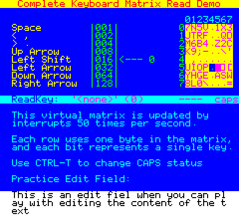

# Keyboard-FullMatrix
Sample code demonstrating how to read the keyboard without using the code from the Oric system ROM.

# How to build
This code sample requires the [Oric SDK](https://osdk.org/index.php?page=download) to build.

Just run "osdk_build.bat" to compile it, and then "osdk_execute.bat" to launch it.

# How to use
After building and running the project, you should see the following UI:

You can then press one or more keys, the matrix on the top right will then highlight which keys are pressed (limited by your physical keyboard, a typical gaming keyboard on a PC will support more simultaneous key presses than an actual Oric 1 or Atmos).

The **ReadKey** text will also show the name and ASCII code value of the last pressed key, or a symbolic name for special keys:
- **'A' (65)**
- **'LEFT SHIFT' (3)**
- or **'\<none\>' (0)** if no keys are pressed

The **----** on the same line shows the status of the modifiers key (C for Control, S for Shift, F for Function).

The **caps** will change into **CAPS** when using CTRL-T and represents the current 'caps lock' status.

And finally, the Practice Edit Field will show what you have been typing, it supports caps lock, shifting, and deleting as well.

# Reasons
If you are wondering why anyone would want to reinvent the wheel, you need to know a few things about the Oric:
- The system IRQ runs at 100hz by default, which on the poor 1mhz 6502 is quite costly (simply disabling the IRQ can provide up to a 20% performance boost)
- Trying to reduce the system IRQ from 100hz to 50hz tends to cause problems, so you need to run your own handler anyway.
- If you are trying to free as much memory as possible for you own usage, you can exploit the fact that the disk drive system gives your access to the top 16KB of RAM which are normally hidden by the system ROM, which also mean you can use the entire zero page and page 2 whatever way you want.

So obviously if you disable the ROM you have to do everything yourself, including driving the keyboard.

# Limitations
This code is not trying to be a complete recreation of the system ROM; which means...
- It does not support things like auto-repeat when a key is pressed
- It does not do nice KLICK and KLOCK sounds when you press keys

# Authors
This code is the result of a cooperation between multiple people.
- Jonathan Bristow (Twilighte) made the first version which properly set up the VIA and keyboard hardware
- Chema Enguita (Chema) adapted and improved that code when he started to work on Blake's 7
- Mickaël Pointier (Dbug) for this small demo and the article on OSDK.ORG

# Additional information
You can find more information on the topic in various places:
- [The Oric Keyboard matrix](https://wiki.defence-force.org/doku.php?id=oric:hardware:oric_keyboard) on the Defence Force wiki
- [Keyboard Handling article (part 2)](https://osdk.org/index.php?page=articles&ref=ART20) in the OSDK articles section
